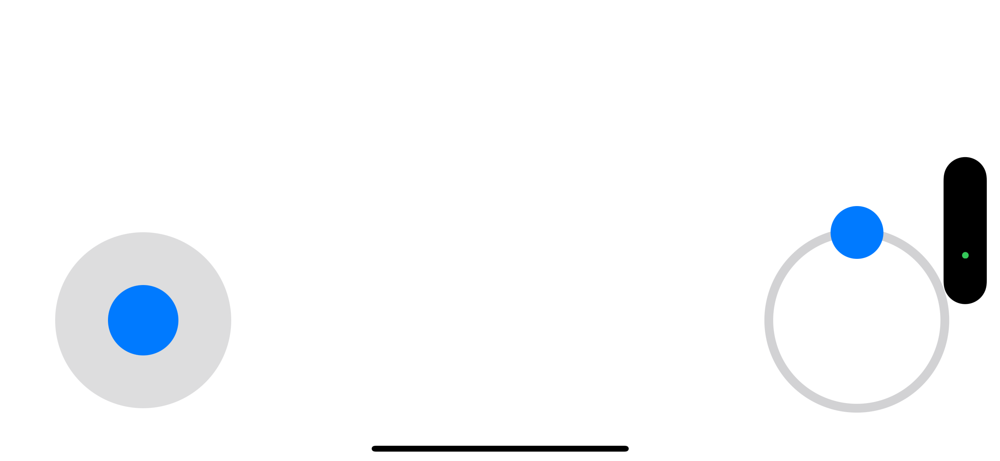

# Mobile SO101 "LeKiwi" Teleop App

The idea is a rather simple one: using the phone as a controller because it has built-in sensors that can be mapped to 6DOF.
Compared to another arm ($$$) or buying VR headset and game controllers, a mobile app is the cheaper and also a more accessible option to provide teleop with OK accuracy. 

It uses a virtual joystick for the movement

- Phone movement -> wrist movement. This is based on ARKit world tracking.
- Phone rotation -> wrist rotation.
The action button on the screen controls the gripper.

## Usage

1. Repository setup on Raspberry Pi
Clone this fork of LeRobot: https://github.com/TheWisp/lerobot/tree/lekiwi-eef. The repository contains the required additional inverse kinematic support to control LeKiwi in the end-effector space rather than the joint-space.

You would also need this repository https://github.com/TheRobotStudio/SO-ARM100 in order to get the URDF file for the arm part of the robot.

Note: All of the repositories above need to be cloned on your Raspberry Pi, not your local computer!

2. Setup LeKiwi
Follow the [HuggingFace Lekiwi tutorial](https://huggingface.co/docs/lerobot/lekiwi) to set up the remote Lekiwi host in the Raspberry Pi environment. Note that you can skip the calibration step from the tutorial for now, because we are using a different robot type and robot ID, and we will calibrate the robot upon the first run.

3. Build and run the app
Open the iOS project in this repository using XCode. Then, change the network configuration to match your local Raspberry Pi setup. By default, this is the IP of `raspberripi.local`. You can find the IP with the following command:

```
ssh raspberrypi.local hostname -I

Result:
192.168.1.137 <IPv6...>
```

In `LeRobot_RemoteApp.swift`, change the IP to matching the LeKiwi host.
```
    public static let remoteIP = "192.168.1.137"
    public static let cmdPort = "5555" // Usually shouldn't need to change
    public static let videoPort = "5556" // Usually shouldn't need to change
```

Finally, choose your target iPhone and deploy the iOS app. You may need to enable developer mode and trust the computer in order to run the untrusted app.



4. Run the host robot
Activate the environment:
```
conda activate lerobot
```

Replace the path to the URDF with the one in your own repository and run the command:
```
python -m lerobot.robots.lekiwi.lekiwi_host --robot.type=lekiwi_end_effector --robot.id=my_awesome_kiwi --robot.urdf_path="/home/feit/SO-ARM100/Simulation/SO101/so101_new_calib.urdf"
```


